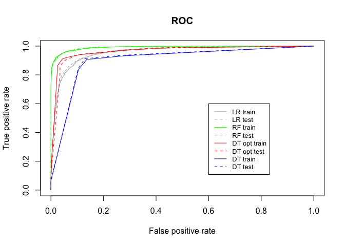

# Credit-Risk-Modeling-Project

Dataset: https://www.kaggle.com/teejmahal20/airline-passenger-satisfaction

- Part I: Credit Scoring using WOE
    - Fine classing & calculate WOE
    - Coarse classing % calculate WOE
    - Logistic Regression
    - Quality Assessment

distribution of the scores cared [1: defaulted / 0: not defaulted]

    
- Part II: Tree-based Models 
  - decision tree model
  - random forest model 
  - model interpretability using SHAP

- Part III: Model Comparison
- 

|      |   models                 |   train_aucs  |   test_aucs  |
|------|--------------------------|---------------|--------------|
|   1  |   logistic regression    |   0.95618     |   0.95890    |
|   2  |   basic decision tree    |   0.90282     |   0.90626    |
|   3  |   optimal decision tree  |   0.96584     |   0.96168    |
|   4  |   random forest          |   0.99167     |   0.99190    |
